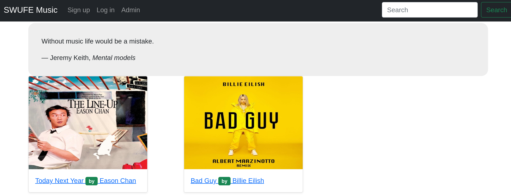
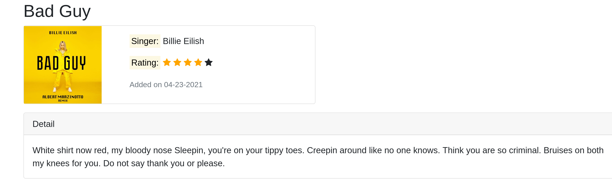

This is a toy music website, and you can borrow designs from it to implement your own online book website.

Note that there are some basic functionalities that are left un-implemented intentionally. For example,
- Database integration
- User log-in/sign-up
- Admin delete books

Also, there are some `bad` designs which you can try your best to improve. For example, 
- We may suppose users would access `/` and then they will be forwarded to `home.jsp`. But what if users visit `home.jsp` directly?
- For Admin related pages, It would be better that the `is logged` check also works when visiting `jsp` or `html` pages directly? 
- It would be better to reuse nav bar and footer.

## Screenshots

